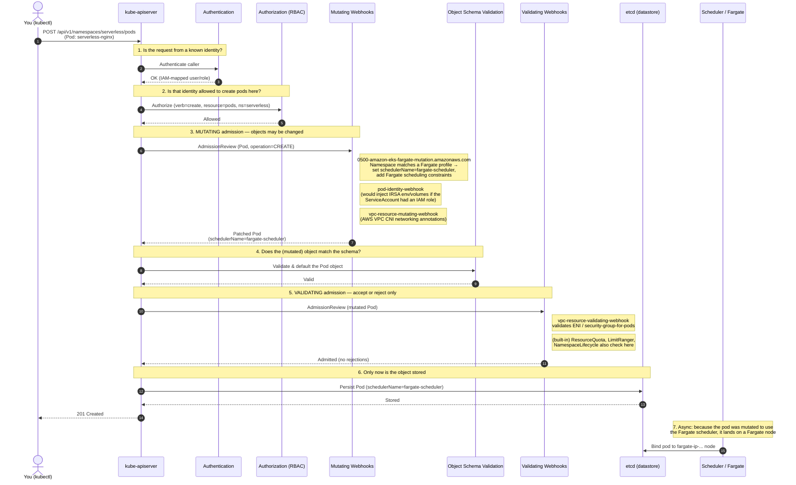

# Kubernetes Admission Control on EKS — the Fargate nginx Pod

This document explains how a Kubernetes API request travels through
**authentication → authorization → admission control → persistence**, using a
concrete example: creating the `serverless-nginx` pod in the `serverless`
namespace on our EKS cluster, which ends up running on **AWS Fargate**.

It mirrors the request-lifecycle diagram from the official Kubernetes docs
([Admission Controllers Reference](https://kubernetes.io/docs/reference/access-authn-authz/admission-controllers/)),
but with the real admission webhooks registered on *our* cluster.
Content was rephrased for compliance with licensing restrictions.

---

## The big picture

When you run `kubectl apply -f serverless-pod.yaml`, the request does **not** go
straight into the cluster's datastore. The `kube-apiserver` runs it through a
pipeline. Admission controllers are the last gatekeepers before the object is
persisted to etcd, and they come in two flavours that run in this order:

1. **Mutating admission** — may *change* the object (e.g. inject fields).
2. **Validating admission** — may *accept or reject* the object, but not change it.

On EKS you cannot pass `--enable-admission-plugins` to the API server (AWS
manages the control plane), but **dynamic admission webhooks** are configured as
normal API objects, so they are fully in play. The ones below are real and were
read from the live cluster.

---

## Sequence diagram: creating the Fargate nginx pod



---

## Why this matters for the Fargate example

The magic that put `serverless-nginx` on Fargate happened at **step 3
(mutating admission)** — you never wrote `schedulerName: fargate-scheduler` in
your YAML:

```yaml
# serverless-pod.yaml — what YOU wrote
apiVersion: v1
kind: Pod
metadata:
  name: serverless-nginx
  namespace: serverless          # <-- matched by the EKS Fargate profile
spec:
  containers:
  - name: nginx
    image: nginx:1.27
```

Because the `serverless` namespace matches a **Fargate profile**, the
`0500-amazon-eks-fargate-mutation.amazonaws.com` mutating webhook intercepted the
`CREATE` and **patched the pod** to use the `fargate-scheduler`. That mutated
object is what got stored in etcd and later scheduled onto a Fargate micro-VM.

This is admission control doing its job invisibly: your request was
*transformed* before it was ever persisted.

---

## The actual webhooks on our cluster

Read live with `kubectl`:

```bash
kubectl get mutatingwebhookconfigurations
kubectl get validatingwebhookconfigurations
```

| Webhook | Type | What it does |
|---|---|---|
| `0500-amazon-eks-fargate-mutation.amazonaws.com` | Mutating | On pod `CREATE`, if the namespace matches a Fargate profile, sets the Fargate scheduler + constraints |
| `pod-identity-webhook` | Mutating | Injects IRSA (IAM Roles for Service Accounts) env vars & token volume |
| `vpc-resource-mutating-webhook` | Mutating | AWS VPC CNI networking mutations |
| `vpc-resource-validating-webhook` | Validating | Validates ENI / security-group-for-pods resources |

Details of the Fargate webhook (also read live):

```
Name:       0500-amazon-eks-fargate-mutation.amazonaws.com
Resources:  ["pods"]
Operations: ["CREATE"]
FailurePolicy: Ignore        # if the webhook is unreachable, don't block pod creation
```

---

## Key teaching points

- **Order matters:** authentication → authorization → **mutating** admission →
  schema validation → **validating** admission → etcd. Mutation always runs
  before validation, so a validating webhook sees the *final* object.
- **Mutating vs. Validating:**
  - *Mutating* controllers can change objects (inject sidecars, set defaults,
    add the Fargate scheduler). Multiple mutating webhooks can run in sequence.
  - *Validating* controllers can only say **yes/no**; they never modify the
    object.
- **Nothing is stored until admission passes.** etcd only ever sees admitted
  (and possibly mutated) objects.
- **On EKS you don't control the API server flags**, but you *can* register your
  own admission logic via `ValidatingWebhookConfiguration`,
  `MutatingWebhookConfiguration`, or the built-in, CEL-based
  `ValidatingAdmissionPolicy` (no webhook server required).
- **`failurePolicy` is a design choice:** the Fargate webhook uses `Ignore`
  (availability over enforcement); a security policy would use `Fail` (reject if
  the webhook can't be reached).

---

## Try it yourself

```bash
# See admission controllers acting on your objects
kubectl get mutatingwebhookconfigurations
kubectl get validatingwebhookconfigurations
kubectl get validatingadmissionpolicies

# Watch the Fargate mutation in action: this pod has no schedulerName,
# yet ends up on a Fargate node because of the mutating webhook.
kubectl run demo --image=nginx:1.27 -n serverless
kubectl get pod demo -n serverless -o jsonpath='{.spec.schedulerName}{"\n"}'
# -> fargate-scheduler   (injected by admission control, not by you)
```

> The Mermaid diagram above renders automatically on GitHub/GitLab and in any
> Markdown viewer with Mermaid support (e.g. VS Code with the Mermaid extension).
